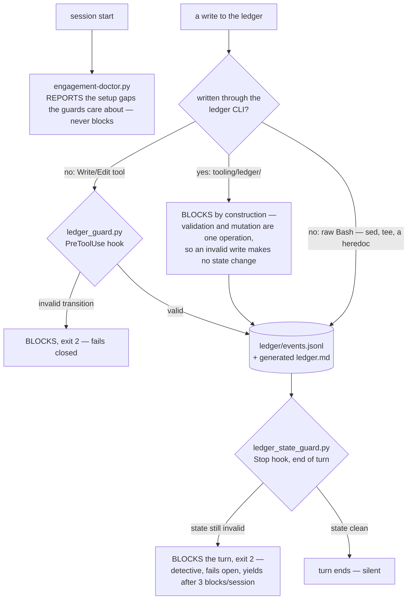

# Audit enforcement harness

[](https://github.com/RichJamo/audit-harness/actions/workflows/tests.yml)
[](LICENSE)
[](#running-the-tests)

This is the machinery that makes two rules of a smart-contract audit method hold whether or not
the person — or the model — doing the audit chooses to follow them. It is a ledger command line
tool, two Claude Code hooks, a setup doctor and a scaffold. Both rules held only in prose for most
of this project's life, and `docs/guard-register.md` records that one of them — "no argument-kills"
— was broken by 7 of 11 parked rows on one audit.

## The two rules

1. **A hypothesis is killed only by a failed proof-of-concept, or escalated to a human — never by
   an argument in prose.** "I thought about it and it is safe" is not a result. If you believe a
   thing is safe, write the exploit that should work and watch it fail.
2. **Correctness is decided by a proof-of-concept; scope is decided by the human.** Whether the
   code is broken is an evidence question. Whether a break falls inside this programme's rules is
   a judgement call that belongs to a person, and a real bug is never quietly dropped as "probably
   out of scope".

Both rules were written in prose for a long time, in bold, in two places, and both were broken
repeatedly and silently. Nothing errored when a row was argued away, so nothing corrected it. That
is what this harness is for: the rules are now preconditions of the operation rather than advice.

## See it refuse

The CI `scaffold` job in `.github/workflows/tests.yml` runs this on every push: it writes a
hypothesis, tries an illegal jump from `UNTESTED` straight to `CONFIRMED`, and asserts the guard
refuses it. Here is the same thing run by hand, commands and output both pasted from a real run:

```sh
$ ./tooling/new-engagement.sh audit /tmp/demo
scaffolded /tmp/demo/audit
  [... the rest of the scaffolded layout, cut here — see tooling/new-engagement.sh ...]
guard self-check: clean

$ printf '| H1 | fee rounds down |  |  | UNTESTED |  |  |\n' >> /tmp/demo/audit/ledger/ledger.md

$ echo '{"tool_name":"Edit","tool_input":{"file_path":"/tmp/demo/audit/ledger/ledger.md","old_string":"| H1 | fee rounds down |  |  | UNTESTED |  |  |","new_string":"| H1 | fee rounds down |  |  | CONFIRMED |  |  |"}}' \
  | python3 tooling/guards/ledger_guard.py
BLOCKED by ledger guard (docs/guard-register.md):
  - G1 [H1] UNTESTED -> CONFIRMED skips TIER-1. Reaching CONFIRMED implies harness work, and the dedup obligation is owed BEFORE that spend, not after. Promote to TIER-1 with a DEDUP: sidecar first.
  - G10 [H1] CONFIRMED with no PoC artifact named anywhere on the row. A finding is claimed with a PoC, never with prose. No PoC means no submission -- and on a platform where the PoC field is optional, this guard is the only thing enforcing that. Write `EVIDENCE: <path>` on the row.

$ echo $?
2
```

The JSON on stdin is the same shape Claude Code sends a `PreToolUse` hook for a real `Edit` tool
call, so this is the hook itself refusing the write, not a stand-in for it.

## The three layers that enforce them, plus the doctor

Every audit hypothesis lives as one row in a ledger, and every decision about it is a change of
that row's status. All four pieces below work on that one artefact.



The `PreToolUse` hook only ever sees a `Write` or `Edit` tool call, so raw Bash — `sed`, `tee`, a
heredoc — walks straight past it; the `Stop` hook is what catches that, from the file's state
rather than the tool call. The ledger CLI's preconditions are stronger still: an invalid mutation
never reaches disk at all, so there is nothing for either hook to refuse.

| | what it is | how binding it is |
|---|---|---|
| **`tooling/ledger/`** — the ledger command line tool | The rules are preconditions of the mutation. State lives in an append-only `ledger/events.jsonl`; the readable `ledger.md` is a generated render. Skipping a check produces *no state change*, not an unchecked one. | Strongest. Validation and mutation are one operation, so there is no gap for a write to slip through. |
| **`tooling/guards/ledger_guard.py`** — a `PreToolUse` hook | Fires before a `Write` or `Edit` that touches a ledger, and refuses the change if the row is missing the evidence the method requires. Fails closed. | Binding for the paths it matches. It cannot see a change made through the shell. |
| **`tooling/guards/ledger_state_guard.py`** — a `Stop` hook | Re-checks the same rules against the ledger's current state at the end of a turn, so they hold whatever wrote the file — `sed`, a heredoc, a subagent that chose the shell. Fails open, and yields after three blocks in a session. | Detective rather than preventive: when it fires, the bad write has already landed. It guarantees the violation is not silent. |
| **`tooling/engagement-doctor.py`** — run at session start | Reports every setup fact the guards care about, names the guard that cares, and can create the missing directories. A guard tells you at the moment it matters, which is mid-hunt; the doctor tells you at setup. | Advisory. It reports, it never blocks. |

`docs/guard-register.md` is the register: every rule that is enforced by machinery, its pass
criterion, and the measured failure that justifies it. `docs/hypothesis-ledger.md` is the ledger
format and the status taxonomy.

One deliberate design constraint runs through all of it: **row creation is never gated.** The
hunting phases generate wide and suppress nothing, so every row starts life untested. A gate
demanding justification before a hypothesis may be written down would throttle the search and cost
real findings. The gates sit on status *transitions* only.

## What is not here

**The hunting workflow is deliberately not included.** The method this harness belongs to also has
a core that tells a hunter where to look: the hunter prompts, the phase instructions, the pattern
catalogues and the coverage checklists. None of that is here. Competitive audit payouts fall
steeply with the number of people who find the same bug, so that half stays private. What you get
is the part that is worth sharing: the discipline, not the leads.

Because of that, files here sometimes point at documents this repository does not contain — phase
files, pattern catalogues, measurement notes under `bench/`. Those references are left exactly as
they are rather than edited away, so it is visible where the private half used to be. In the same
way, the doctor may suggest running hypothesis generators (a refutation critic, an opposite-tail
detector, a fix-adjacency scanner): those are hunting tools and are not part of this release.

`docs/not-included.md` lists every one of those missing files by name, with one line on what each
is.

## Installing it

The hooks resolve their scripts by absolute path, under `${AUDIT_HARNESS_HOME:-$HOME/audit-toolkit}`.
That is on purpose: the documented alternative resolves to wherever the session happened to start,
which during a real audit is the target's directory, and a hook that silently expands to the wrong
path fails in a way that looks exactly like enforcement.

Clone it into `~/audit-toolkit` and set nothing, or clone it anywhere else and point
`AUDIT_HARNESS_HOME` there:

```sh
git clone <this repo> ~/audit-toolkit     # the default; nothing else to set
# -- or, cloned anywhere else --
git clone <this repo> <wherever you put it>
export AUDIT_HARNESS_HOME=<wherever you put it>   # add this line to your shell profile

cd "${AUDIT_HARNESS_HOME:-$HOME/audit-toolkit}"
tooling/bootstrap.sh                      # Slither, Aderyn, solc-select, pyyaml, ruff
tooling/install-hooks.sh                  # merges the SessionStart hook into ~/.claude/settings.json
tooling/install-hooks.sh --check          # report drift, change nothing
```

`bootstrap.sh` assumes Foundry (`forge`) is already present. `install-hooks.sh` merges rather than
overwrites, backs the file up first, and refuses to touch settings it cannot parse. The other two
hooks need no installation step: they are declared in `skill/SKILL.md`'s frontmatter and travel
with the skill.

Then scaffold an audit:

```sh
tooling/new-engagement.sh <name> [parent-dir]   # parent-dir defaults to ~/engagements
```

The scaffold is the layer that removes the decision instead of policing it: the ledger is copied
from `templates/ledger.template.md`, so its format is right before anyone can get it wrong, and
the script proves the result passes the guards rather than asserting it.

## Running the tests

```sh
python3 -m unittest discover -s tooling -p "test_*.py"
ruff check tooling
```

`tooling/guards/hooktest/` is a separate live suite that drives the hooks through their real stdin
contract, covering the wiring and the write path rather than the rule logic: `./reset.sh && python3
verify.py`. It builds its fixtures outside the repository on purpose — every path inside the
toolkit is exempt from the guards, because the documentation here contains ledger-shaped tables
that must not be gated, and fixtures kept beside the suite would inherit that exemption and pass
having run no guard at all.

## Licence

MIT. See `LICENSE`.
